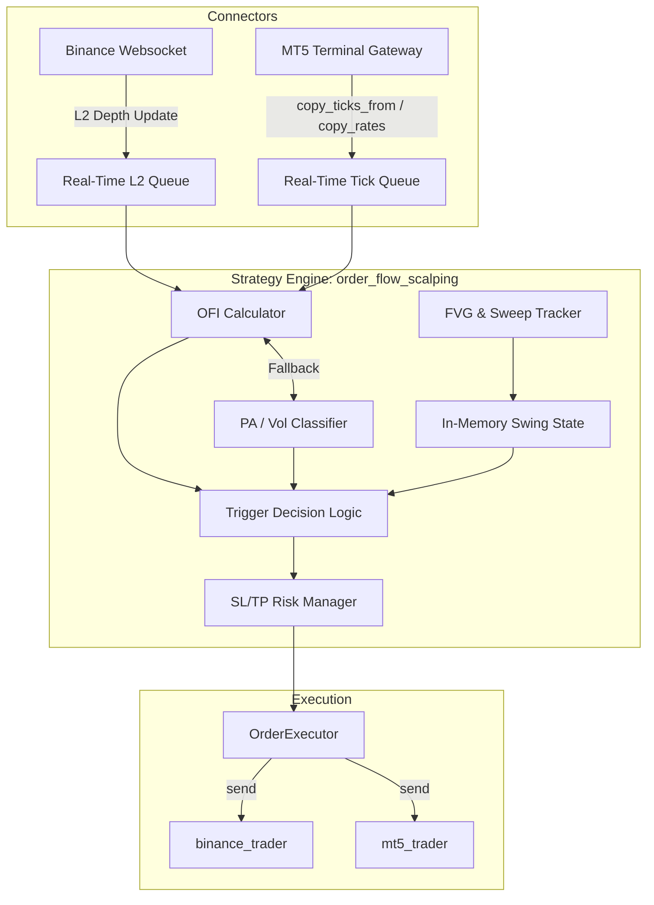

# Technical Design: Order-Flow Scalping Strategy

## 1. System Architecture & Components
The strategy will be implemented as a dedicated modular strategy folder under `strategies/order_flow_scalping/` following **Approach 1** from exploration.

## 2. Real-Time Data Flow & Ingest
- **Binance (Crypto)**: Connects to the Binance Futures WebSocket (`diffDepth` stream @ 100ms or `depth` stream). Level 2 updates are queued asynchronously.
- **MT5 (Futures)**: Polls tick streams via `copy_ticks_from` or `symbol_info_tick` inside a fast tick-collection thread (sleep interval < 10ms).
- **L2 / Tick Delta Queue**: Thread-safe queue containing order book updates or raw ticks to prevent blocking the main strategy loop.

## 3. OFI & Algorithmic Logic
### 3.1 Order Flow Imbalance (OFI) Calculation
For a limit order book (L2) with Bid Price $P_b$, Bid Quantity $Q_b$, Ask Price $P_a$, and Ask Quantity $Q_a$:
$$\Delta Q_b(t) = \begin{cases} Q_b(t), & \text{if } P_b(t) > P_b(t-1) \\ Q_b(t) - Q_b(t-1), & \text{if } P_b(t) = P_b(t-1) \\ 0, & \text{if } P_b(t) < P_b(t-1) \end{cases}$$
$$\Delta Q_a(t) = \begin{cases} 0, & \text{if } P_a(t) > P_a(t-1) \\ Q_a(t) - Q_a(t-1), & \text{if } P_a(t) = P_a(t-1) \\ Q_a(t), & \text{if } P_a(t) < P_a(t-1) \end{cases}$$
$$OFI(t) = \Delta Q_b(t) - \Delta Q_a(t)$$

### 3.2 L2 Fallback (Tick Volume & Price Action)
If L2 depth is unavailable, the system defaults to tick-level trade flow classification:
- **Taker Buy/Sell (Binance Spot/Futures)**: Directly reads `Taker_Buy_Volume` and `Taker_Sell_Volume` from incoming trades/klines:
  $$OFI_{fallback} = V_{taker\_buy} - V_{taker\_sell}$$
- **Tick Volume Profile (MT5)**: Uses tick direction (up/down tick) or relative close position inside the bar:
  $$OFI_{fallback} = Volume \times \frac{Close - Low}{High - Low} - Volume \times \frac{High - Close}{High - Low}$$

### 3.3 Liquidity Sweeps & FVG Detection
- **Swing High/Low Identification**: Monitors recent local extrema (3-5 bar pivots).
- **Sweep Condition**:
  - *Bullish Sweep*: Low sweeps a previous Swing Low, but current price closes above that swing low level.
  - *Bearish Sweep*: High sweeps a previous Swing High, but current price closes below that swing high level.
- **FVG Mitigation**: An FVG is recorded via `analysis/imbalance.py`. The strategy tracks the FVG bounds in memory. If a sweep overlaps with an unmitigated FVG boundary (50% equilibrium or full mitigation), the signal strength is amplified.

## 4. In-Memory State Tracking
The strategy maintains a lightweight state machine:
- `swing_highs` / `swing_lows`: Deque of the last $N$ pivots.
- `active_fvgs`: Dict tracking active FVGs, their bounds, and mitigation status.
- `last_ofi_window`: Rolling window of calculated OFIs to compute rolling Z-scores for normalized trigger thresholds.

## 5. Execution & Risk Engine
- **Entry**: Immediate Market Order via `OrderExecutor` upon:
  1. Liquidity Sweep confirmation.
  2. Coincident OFI Z-score crossing user-defined threshold ($Z_{OFI} > 2.0$ or $Z_{OFI} < -2.0$).
- **Stops & Targets**:
  - **Stop Loss (SL)**: Set strictly behind the sweeping wick (protective high/low plus a safety offset of $0.5 \times ATR$).
  - **Take Profit (TP)**: TP1 at $1:1$ RR, TP2 at the opposite liquidity pool (unmitigated swing high/low) with a trailing stop once TP1 is hit.

## 6. File Changes
- **New Files**:
  - `strategies/order_flow_scalping/__init__.py`
  - `strategies/order_flow_scalping/manifest.json`: Metadata for listing in shell.
  - `strategies/order_flow_scalping/run.py`: Event loop, ingest thread, indicators connection, and execution.
- **Modified Files**:
  - `analysis/imbalance.py`: Expose helper functions for rolling calculations and tick volume classifiers.
  - `ui/shell.py`: Minor integration details if needed (strategy run loads it automatically via dynamic execution).
